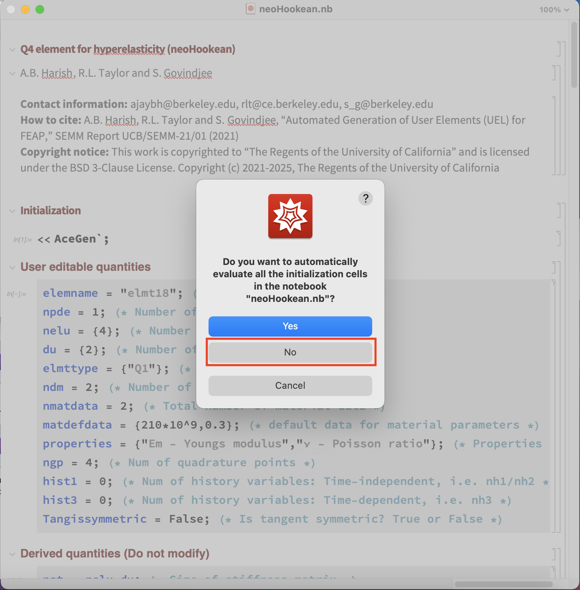
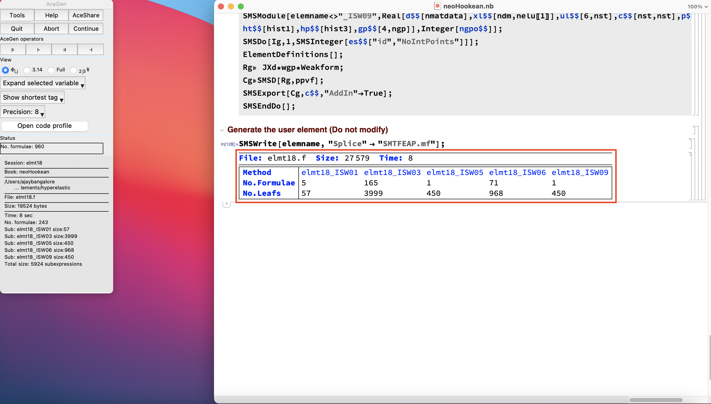
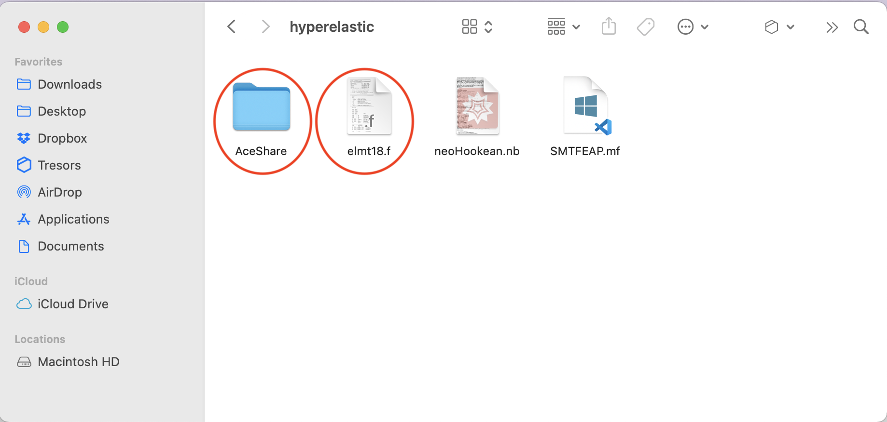

# Automated generation of user elements

## How to cite

Harish, A. B. and Taylor, R. L. and Govindjee, S., "Automated Generation of User Elements (UEL) for FEAP," SEMM Report UCB/SEMM-21/01 (2021)

## Contact information

Any questions related to the repository can be raised on the [FEAP user forum](http://feap.berkeley.edu/forum/index.php).

## Folder information

This repository has the files related to the AceGen template that has been developed to automatically generate user elements for [FEAP](http://projects.ce.berkeley.edu/feap/). The folders available in this repository are as below:

- *user-elements*: This folder contains the Mathematica notebooks and the generated FEAP user elements (*elmtXX.f*)

- *dependencies*: This contains the dependencies for using the Mathematica notebooks and the generated FEAP user elements. 

## How to generate user elements

- Copy the *SMTFEAP.mf* file from the folder *dependencies/AceGen* into the same folder as the Mathematica notebook. The Mathematica noteboks are available in the folder *user-elements*.

- Open the Mathematica notebook and use *Evaluate Notebook* from the *Evaluate* menu to compile the Mathematica notebook as shown below

- Upon starting to compile, often, Mathematica can ask one to evaluate the initialization cells. It is recommended to select *No* option, as shown below

- Upon successful compilation, the Mathematica notebook shows a confirmation that includes the element number. 

- In addition, upon successful compilation, the user element (*elmtXX.f*) and an *AceShare* folder are created in the same folder as the Mathematica notebook. The number *XX* is controlled by the name provided in the Mathematica notebook.

- Often, one of the common errors is that the *SMTFEAP.mf* is not in the same folder as the Mathematica notebook. This results in an error that says "*Splice file doesn't exist*" as shown below.

## How to use the generated elements

- 