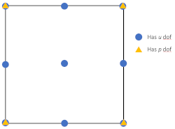

# Elements for coupled problems

This repository is a collection of elements for <a href="http://projects.ce.berkeley.edu/feap/" target="_blank">FEAP</a> to help address coupled problems. The elements, provided here are generated using <a href = "http://symech.fgg.uni-lj.si/" target="_blank">AceGen</a>. AceGen is available as an add-on for Mathematica and facilitates the automatic generation of user elements using an automatic differentiation approach. A detailed discussion on AceGen can be found in the work of Korelc and Wriggers [1].

## Poro-elasticity

### Q9/Q4 Taylor-Hood element
This 2-D nine-noded element is developed as a part of the work [4] presented as a part of the Festschrift on the occasion of the 70th birthday of <a href="https://www.ikm.uni-hannover.de/de/wriggers/" target="_blank">Prof. Peter Wriggers</a>. The element topology is as shown below.

It uses bi-quadratic interpolation functions for the displacement d.o.f's and linear interpolation functions for the pressure d.o.f's.

# Running the elements with FEAP
For help on compiling FEAP on Mac or Linux

For help on compiling FEAP on Windows

# References
1. J. Korelc and P. Wriggers, "Automation of Finite Element Methods," Springer International Publishing, Switzerland (2016)

2. FEAP programmer manual, http://projects.ce.berkeley.edu/feap/pmanual_86.pdf

3. FEAP user forum, http://feap.berkeley.edu/forum/index.php

4. A. B. Harish, R. L. Taylor and S. Govindjee, "A Poroelastic Element for FEAP Using AceGen," Festschrift on the occasion of 70th Birthday of Peter Wriggers (Coming soon)
